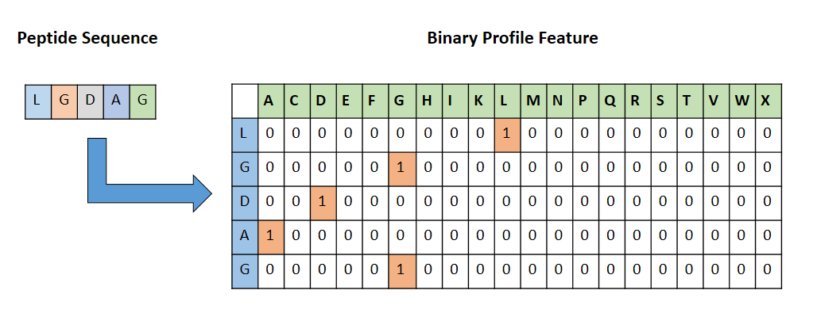

#  DeepAmp: A deep learning tool for predicting A sites.

### Abstract


### [1]. Read File:
All the datasets file are in `FASTA` format which can be with `.txt` or `.fasta` extension. E.g. `anyName.txt` or  `anyName.fasta`. Please know more about the FASTA file format [by clicking here!](https://en.wikipedia.org/wiki/FASTA_format).

```
>1AOII|1
ATCAATATCCACCTGCAGATTCGATTCAACTACCAGATTCGATTCAACTACCAGATTCGATTCAACTACCACTGCAGATTCGATTCAACTACCAGATTCGATTCAACTACCAGATTCGATAGATTCGATTCAACTACCAGATTCGATTCAACCTACCAGATTCGATTCAACTACCACTGCAGATTCGATTCAACTACCAGATTCGATTCAACTACCAGATTCGATAGATCTACCAGATTCGATTCAACTACCACTGCAGATTCGATTCAACTACCAGATTCGATTCAACTACCAGATTCGATAGAT
>2AOII|2
ATCAATATCCACAATACCTGCAGATTCTACCGATTCGATTCAACTACCAGATTCGATTCAACGATTCGATTCAACTACCAGATTCGATTCAACTACCACTGCAGATTCGATTCAACTACCAGATTCGATTCAACTACCAGATTCGATAGATTCGATTCAACTACCAGATTCGATTCAACCTACCAGATTCGATTCAACTACCACTGCAGATTCGATTCAACTACCAGATTCGATTCAACTACCAGATTCGATAGATCTACCAGATTCGATTCAACTACCACTTACCACTGCAGATTCGATTCAACTACCAGATTCGATTCAACTACCAGATTCGATAGATTCGATTCAACTACCAGATTCGATTCAACCTACCAGATTCGATTCAACTACCACTGCAGATTCGATTCAACTACCAGATTCGATTCAACTACCAGATTCGATAGATCTACCAGATTCGATTCAACTACCACTA
```

### [2]. Feature Generation:

#### Binary Profile Feature: 
Feature encoding is the backbone of any computational method. Binary profile features are simple and easy to extract, yet effective for the prediction of different functionalities in the multi-omics dataset. We generated Binary profiles for each peptide, by representing each amino acid by a vector of dimensions of 20. For instance, Alanine is replaced by a 20 size one hot vector which is [1,0,0,0,0,0,0,0,0,0,0,0,0,0,0,0,0,0,0,0]. A sequence of length L was represented by a vector of dimensions L × 20. This feature encoding process is depicted in Figure 1.


### [3]. How to Run Package:

#### [3.1] Test Command-line #1: Run on AMPylation data
```console
user@machine:~$ python main.py
```

#### [3.2] Test Command-line #2: Run on different dataset
```console
user@machine:~$ python main.py -fa data.fasta -la Label.txt
```

**NB: You can use anyone from them.**

**Table 3:**  command line element
| Symbol  | Explanation  |
| ------- | ------------ |
| -fa | Fasta file with .txt or .fasta format  |
| -la | Label file with .txt extension  


### References


